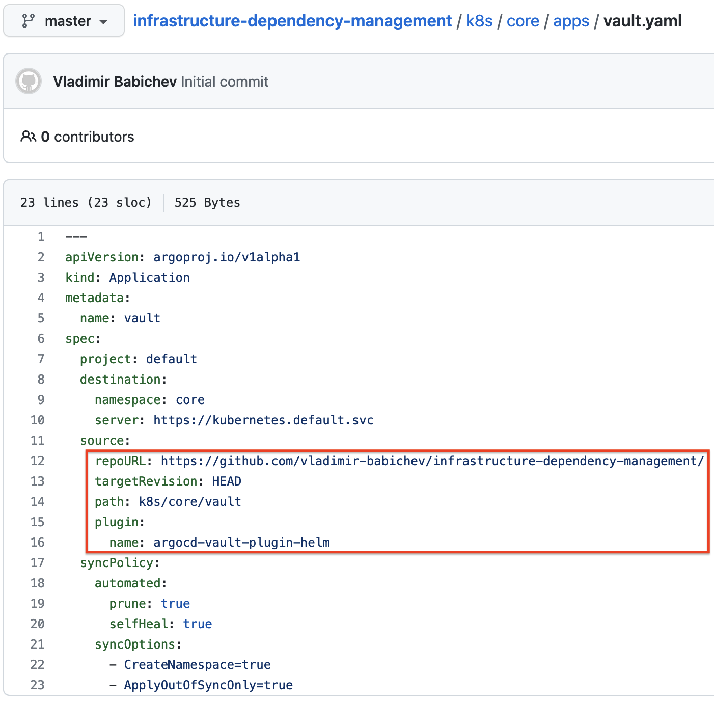
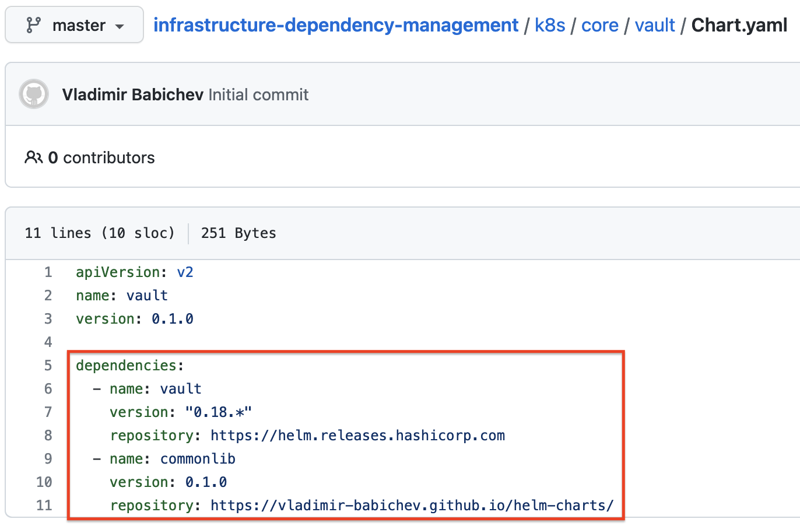
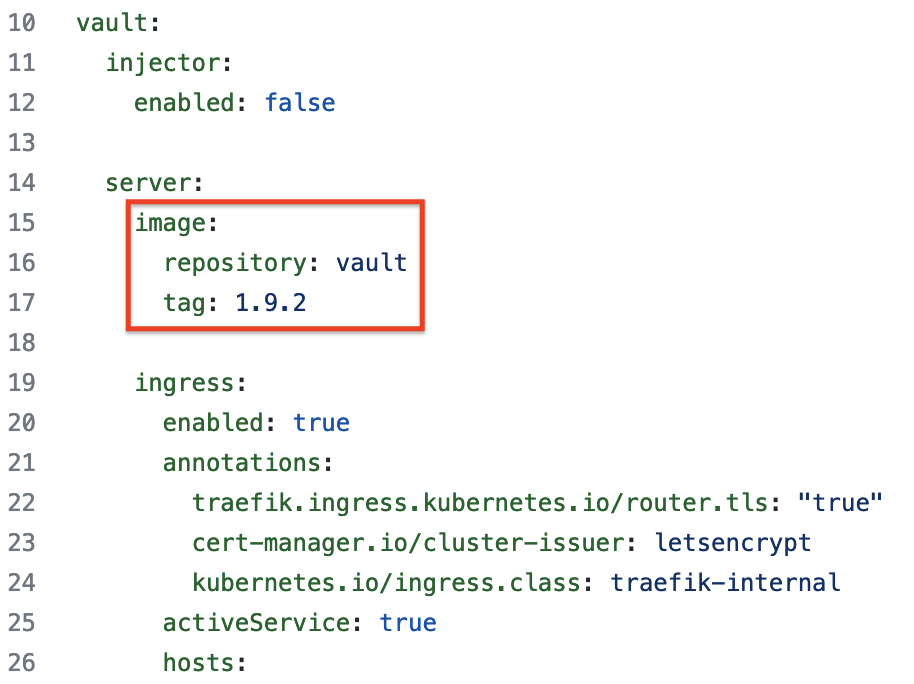
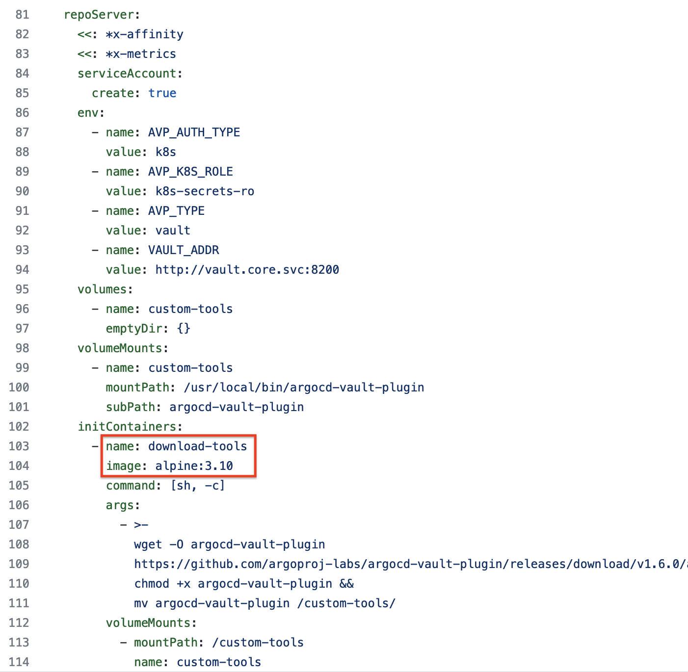
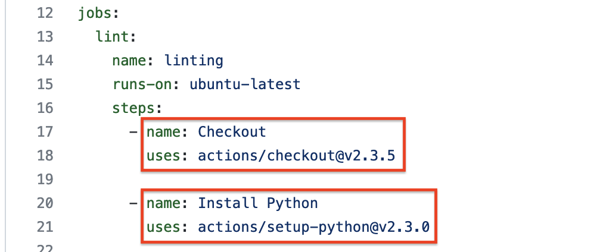

# Infrastructure Dependency Management

It is an Uber repository that does full lifecycle management for the given environment:

1. Infrastructure provisioning
2. Infrastructure configuration
3. Application deployment
4. Application management

## What this repo does

1. Installs Hashicorp Vault Helm Chart
2. Configures Hashicorp Vault using Terraform
3. Installs ArgoCD Helm Chart
4. Installs ArgoCD Application resources
5. Handles control over application management to ArgoCD

## Deployed applications

* [ArgoCD](https://argo-cd.readthedocs.io/en/stable/)
* [Cert-Manager](https://cert-manager.io/docs/)
* [Hashicorp Vault](https://www.vaultproject.io/)
* [Pi-Hole](https://pi-hole.net/)

## Used technologies

* [ArgoCD](https://argo-cd.readthedocs.io/en/stable/)
* [Bash](https://www.gnu.org/software/bash/)
* [GitHub Actions](https://github.com/features/actions)
* [Helm](https://helm.sh/)
* [pre-commit](https://pre-commit.com/)
* [Terraform](https://www.terraform.io/)

## Dependencies

### ArgoCD

* Application deployed as a raw k8s resource
  

* OTS (off-the-shelf) Helm chart deployed from ArgoCD app definition
  

* OTS (off-the-shelf) Helm chart pinned to a specific version from an upstream helm repository and customized with extra resources and values.
  

* Helm charts have dependencies
  

* Helm charts have hardcoded image versions
  
  

### Terraform

* Terraform module used to configure Vault

### pre-commit

* Markdownlint
* Shellcheck
* YamlLint
* pre-commit off-the-shell hooks

### GitHub Actions

* Checkout
* Python
* Cache

## Renovate

[Renovate](https://docs.renovatebot.com/) (often referred to as "Renovate Bot") is an Open Source tool to automate:

* Detecting dependencies in a repository (Open Source and private/closed source)
* Checking if there are newer versions which can be updated to
* Creating commits and Merge/Pull Requests to apply such changes, and show the Release Notes (if available)

### [Supported platforms](https://docs.renovatebot.com/modules/platform/)

* azure
* bitbucket
* bitbucket-server
* gitea
* github
* gitlab

### [Supported Managers](https://docs.renovatebot.com/modules/manager/)

* ansible
* docker-compose
* dockerfile
* github-actions
* helm
* homebrew
* kubernetes
* kustomize
* pre-commit
* terraform
* terragrunt
* ...
